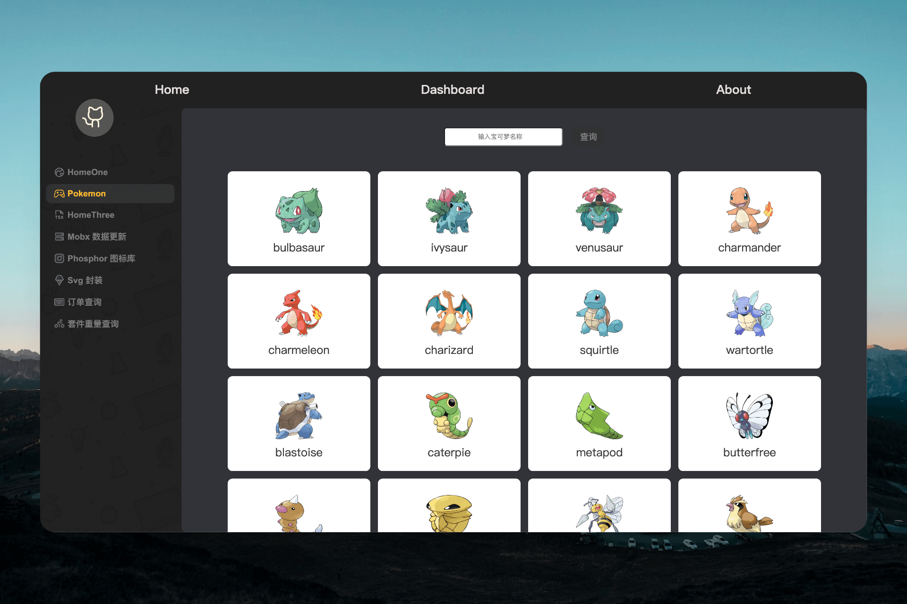

<h1 align="center">react 模板</h1>
<br/>

<div align="center">
    
</div>
<br>
<p align="center">
    简体中文 | <a href="./docs/README.en.md">English</a>
</p>

## ⚡️ Webpack 版本

- react-template-vite: https://github.com/guokaigdg/react-enterprise-template

## 🔗 在线 Demo

-   在线预览 (PC 端) [react-template-vite](https://guokaigdg.github.io/react-enterprise-template/)
-   在线预览（移动端） [react-template-mobile](https://github.com/guokaigdg/react-template-mobile)

## 👨🏻‍💻 项目说明

-   移动端模板：[react-template-mobile](https://github.com/guokaigdg/react-template-mobile)

-   react 模板, 一个比 CRA 更丰富的模板

## 🪅 特性

-   📦 开箱即用，无需配置
-   📝 全面注释说明，学习低成本
-   🚀 启动编译迅速
-   🌱 极易定制, 拓展容易

## 🚀 技术栈

[](https://github.com/facebook/react/) [](https://github.com/microsoft/TypeScript)[](https://github.com/facebook/react/) [](https://github.com/axios/axios) [](https://github.com/mobx) [](https://github.com/remix-run/react-router) []()

-   React v19
-   react-dom v19
-   TypeScript v4
-   vite v6
-   axios v1
-   mobx v6
-   mobx-react-lite v3
-   react-router v7


## ⌛️ 安装项目依赖

-   `node` >= 16.0.0
-   `npm` >= 7.0.0
-   `yarn` >= 1.22.17

```
npm install
```

```
yarn
```

```
pnpm install
```

## 🚀 运行项目

```
npm
$ npm run start

yarn
$ yarn dev
```

## 📦 打包编译

```
npm run build:qa  // 测试环境
npm run build:prod  // 线上环境
```

## 🏷 分支说明

| 分支   | 说明          |
| ------ | ------------- |
| main   | 主分支        |
| dev    | 开发分支      |
| deploy | demo 部署分支 |

## 代码提交规范

```
git <type>: <subject>
git commit -m “feat: 项目初始化”
```

### type 参考:

```
fix       🐛 Bug修复
feature   ✨ 引入新特性
docs      📝 文档书写改动
prune     🔥 移除代码或文件
perf      ⚡ 性能相关优化
rocket    🚀 部署功能
style     💄 style修改
init      🎉 初始化提交
release   🔖 发布版本
wip       🚧 正在进行中, 且有可能出现不稳定运行的提交
config    🔧 修改配置文件
refactot  🔨 重构(既不增加新功能, 也不修改bug的代码改动)
merge     🔀 合并分支
```

## 📂 目录结构

```
    ├── .vscode
    │   └──setting.json                 # 先于vscode全局的settings.json配置
    ├── doc                             # 开发文档记录
    ├── vite.config.ts                  # 打包编译vite配置
    ├── pubilc
    │   ├──favicon.ico                  # HTML图标
    │   └──index.html                   # HTML入口模板
    ├── src
    |   ├── api                         # 接口配置
    |   ├── assets                      # 静态资源
    │   ├── components                  # 项目通用通用组件
    │   ├── http                        # 请求统一封装
    │   ├── httpinterface               # ts类型定义
    │   ├── constData                   # 系统内的常量列表
    │   ├── router                      # 统一路由入口
    │   ├── store                       # 数据共享
    │   ├── styles                      # 全局样式
    │   ├── utils                       # 工具库
    │   ├── view                        # 页面
    │   ├── App.tsx                     # 主界面
    │   └──index.tsx                    # 入口文件
    ├── .babelrc.js                     # babel配置
    ├── .editorconfig                   # 跨编辑器维护一致编码风格
    ├── .env.json                       # 环境变量配置
    ├── .eslintignore                   # ESLint忽略检测文件
    ├── .eslintrc.js                    # ESLint配置
    ├── .gitignore                      # git提交忽略文件
    ├── .npmrc
    ├── .prettierignore                 # prettierc忽略文件
    ├── .prettierrc                     # prettierc配置
    ├── .stylelintrc.js                 # 代码风格配置
    ├── LICENSE                         # 开源协议
    ├── package-lock.json               # npm安装包锁定管理
    ├── package.json                    # 依赖包管理
    ├── README.md                       # 项目说明
    ├── tsconfig.json                   # ts配置文件
    └── yarn.lock                       # yarn安装包锁定管理

```

## 📚 开发资料参考

-   <a href="./docs/data.md">开发资料参考</a>

## 🤝 如何贡献

-   📬 有问题直接 issues 或者留言
-   🧙‍♀️ 欢迎所有的贡献者，快来 Issus 或 Pull requests 成为贡献者吧
-   🙋 [查看如何贡献代码](https://n7j2qc9z43.feishu.cn/docx/HAu9d1PCuo12Cvxrlelc0eEWnNc?from=from_copylink)

## 💡 开源协议

该项目的代码和文档基于  MIT License  开源协议。

# React + TypeScript + Vite

This template provides a minimal setup to get React working in Vite with HMR and some ESLint rules.

Currently, two official plugins are available:

-   [@vitejs/plugin-react](https://github.com/vitejs/vite-plugin-react/blob/main/packages/plugin-react/README.md) uses [Babel](https://babeljs.io/) for Fast Refresh
-   [@vitejs/plugin-react-swc](https://github.com/vitejs/vite-plugin-react-swc) uses [SWC](https://swc.rs/) for Fast Refresh

## 注意事项 
Expanding the ESLint configuration
If you are developing a production application, we recommend updating the configuration to enable type aware lint rules:

-   Configure the top-level `parserOptions` property like this:

```js
export default tseslint.config({
    languageOptions: {
        // other options...
        parserOptions: {
            project: ["./tsconfig.node.json", "./tsconfig.app.json"],
            tsconfigRootDir: import.meta.dirname
        }
    }
});
```

-   Replace `tseslint.configs.recommended` to `tseslint.configs.recommendedTypeChecked` or `tseslint.configs.strictTypeChecked`
-   Optionally add `...tseslint.configs.stylisticTypeChecked`
-   Install [eslint-plugin-react](https://github.com/jsx-eslint/eslint-plugin-react) and update the config:

```js
// eslint.config.js
import react from "eslint-plugin-react";

export default tseslint.config({
    // Set the react version
    settings: { react: { version: "18.3" } },
    plugins: {
        // Add the react plugin
        react
    },
    rules: {
        // other rules...
        // Enable its recommended rules
        ...react.configs.recommended.rules,
        ...react.configs["jsx-runtime"].rules
    }
});
```
